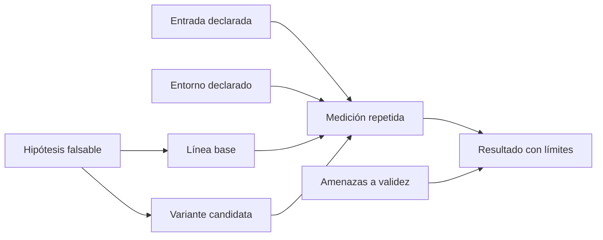

# Evidencia y contrato de medición

**Estado:** draft

Una optimización no empieza con una técnica. Empieza con una afirmación que
podría ser falsa: "para esta entrada y este entorno, la variante B reduce el
tiempo respecto de A sin alterar el resultado". Este capítulo convierte esa
afirmación en un contrato verificable.

## Concepto

La evidencia de rendimiento compara una línea base con una variante bajo
condiciones declaradas. El resultado describe esa comparación; no demuestra que
la variante sea universalmente mejor ni que una línea de código aislada causó
la diferencia.

## Problema medible

Medir una sola vez responde sobre todo qué ocurrió una vez. Sin entrada,
entorno, unidad y repetición, no sabemos si se midió calentamiento, ruido del
sistema operativo, una optimización del compilador o el trabajo que interesa.

## Modelo



El crate representa este contrato con `ExperimentSpec` y solo acepta el
experimento cuando existen campos esenciales, al menos dos muestras y valores
finitos. El modelo no decide que una variante ganó: protege el contexto mínimo
para que la conclusión posterior tenga significado.

## Alternativas

| Enfoque | Qué aporta | Por qué no basta |
|---|---|---|
| Una ejecución con cronómetro | Señal inicial para explorar | No separa ruido ni documenta condiciones. |
| Un promedio sin método | Resumen breve | Oculta dispersión y la selección de muestras. |
| Contrato explícito | Auditoría de comparación y límites | Aún requiere medir y razonar resultados. |

Elegimos el contrato explícito antes de una herramienta de benchmarks. Una
herramienta puede ejecutar mediciones, pero no puede decidir si la entrada
representa el problema ni si la comparación conserva corrección.

## Ejemplo progresivo

El ejemplo ejecutable `01_experimento` registra la pregunta antes de tomar
tiempos. Sus muestras son datos ilustrativos, no una afirmación de rendimiento.

```rust
use rust_performance::measurement::{
    Experiment, ExperimentSpec, Metric, OptimizationDirection,
};

let experiment = Experiment::new(ExperimentSpec {
    name: "Suma de enteros".into(),
    hypothesis: "Un acumulador reduce el tiempo medio para 10 000 enteros.".into(),
    baseline: "iterador".into(),
    candidate: "acumulador".into(),
    input: "10 000 enteros; semilla 42".into(),
    environment: "Rust estable; release; arquitectura declarada".into(),
    metric: Metric::new("tiempo", "ns", OptimizationDirection::LowerIsBetter),
    warmup_runs: 3,
    samples: vec![102.0, 99.0],
    threats_to_validity: vec!["frecuencia dinámica de CPU".into()],
})?;

assert_eq!(experiment.sample_count(), 2);
# Ok::<(), rust_performance::measurement::ExperimentError>(())
```

## Cómo medir después

1. Conserva la misma entrada y resultado observable entre base y candidata.
2. Declara perfil, versión de Rust, arquitectura y condiciones conocidas.
3. Separa calentamiento de muestras reportadas.
4. Examina variación antes de hablar de mejora.
5. Escribe límites: una observación local no se generaliza a otra arquitectura
   ni a otro tamaño de entrada.

## Ejercicios

1. **Inicial:** formula una hipótesis falsable para reducir asignaciones al
   construir una cadena.
2. **Intermedio:** identifica qué datos faltan en un resultado que dice solo
   "B tardó 10 ns".
3. **Avanzado:** diseña dos entradas que puedan refutar la hipótesis de que un
   algoritmo es mejor para todos los tamaños.
4. **Caso real:** redacta un contrato para comparar parsing con copia y parsing
   basado en préstamos, incluyendo la condición de corrección compartida.

## Soluciones orientativas

1. "Para nombres de hasta 32 bytes, reservar capacidad evita asignaciones
   adicionales frente a concatenación repetida"; faltaría definir métrica y
   línea base.
2. Faltan línea base, entrada, unidad confirmada, número de muestras, entorno,
   corrección y amenazas a validez.
3. Usa una entrada pequeña y una grande, conserva distribución y semilla, y
   registra si la conclusión cambia.

Las soluciones no sustituyen la medición: muestran qué debe quedar declarado
antes de ejecutar un benchmark.

## Límites

Este capítulo no enseña estadística inferencial ni profiling. El siguiente
capítulo diseña un harness educativo; los capítulos posteriores usan perfiles
para encontrar dónde vale la pena investigar.
