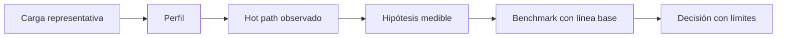

# Profiling y selección de hot paths

**Estado:** draft

Un perfil contesta dónde se observó trabajo en una ejecución concreta. No
contesta automáticamente por qué ocurrió ni qué cambio mejorará el sistema.

## Del perfil a una hipótesis



La ruta con mayor trabajo inclusivo puede incluir el costo de sus llamadas; el
trabajo exclusivo intenta aislar la parte local. Compararlos evita concluir que
una función contenedora debe cambiar cuando el costo está en una llamada hija.

## Modelo educativo

`ProfileSample` declara una ruta, unidades inclusivas y unidades exclusivas.
El modelo rechaza rutas vacías y atribuciones donde lo exclusivo excede lo
inclusivo. Sus unidades son deliberadamente abstractas: un contador no se
interpreta sin saber si representa tiempo, muestras, instrucciones o eventos.

```rust
use rust_performance::profile::{Profile, ProfileSample};

let profile = Profile::new(vec![
    ProfileSample::new("main", 20, 5),
    ProfileSample::new("main::parse", 15, 15),
])?;

assert_eq!(profile.hottest_path(), "main");
assert_eq!(profile.exclusive_units("main"), Some(5));
# Ok::<(), rust_performance::profile::ProfileError>(())
```

El ejemplo indica que `main` acumuló el trabajo de `parse`; no demuestra que
el cuerpo de `main` sea el lugar correcto para optimizar.

## Alternativas

| Enfoque | Problema |
|---|---|
| Optimizar por lectura de código | No prueba que la carga ejecutada llegue a esa ruta. |
| Tratar un hot path como causa | Confunde observación con explicación. |
| Perfil, hipótesis y benchmark | Permite decidir con una comparación reproducible. |

## Ejercicios

1. Explica por qué una ruta con 100 unidades inclusivas y 2 exclusivas merece
   revisar sus llamadas antes de modificarla.
2. Diseña una carga representativa para perfilar parsing de mensajes cortos y
   largos.
3. Formula un benchmark que pruebe la hipótesis nacida de un hot path.
4. Documenta una amenaza a validez de un perfil tomado en modo debug.

## Soluciones orientativas

1. La mayor parte del trabajo puede vivir en descendientes; revisa sus rutas y
   mantén la corrección del resultado antes de cambiar la función contenedora.
2. Conserva distribución, tamaño, codificación y mezcla de errores de la carga
   real; declara lo que no se representa.
3. Compara la misma entrada y resultado observable contra una línea base, con
   muestras repetidas y entorno declarado.
4. Las optimizaciones del compilador y el layout de debug pueden alterar rutas,
   inlining y costos observados frente a release.

## Límites

El modelo no reemplaza `perf`, Instruments, flamegraphs ni instrumentación. La
herramienta elegida depende de plataforma y de la pregunta; la disciplina de
interpretación permanece igual.
