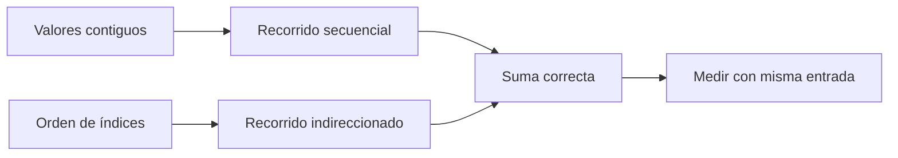

# Caché y localidad

**Estado:** draft

La caché no es un truco para memorizar; es una jerarquía que vuelve relevante
el orden de acceso a los datos. El punto de partida es conservar corrección y
comparar patrones equivalentes.

## Concepto

La localidad espacial aparece al recorrer datos cercanos en memoria. La
temporal aparece cuando un dato se reutiliza antes de ser desplazado. Un
recorrido contiguo suele dar al hardware oportunidades distintas de un
recorrido que sigue índices dispersos, pero el efecto depende de la carga y la
plataforma.



## Modelo

`sum_contiguous` recorre un slice en su orden de memoria. `sum_indirected`
recorre los mismos valores mediante una permutación de índices y rechaza
referencias fuera de rango. Los dos modelos pueden producir la misma suma;
compararlos permite hablar del patrón de acceso sin cambiar la semántica.

```rust
use rust_performance::locality::{sum_contiguous, sum_indirected};

let values = [4_i64, -2, 7, 1];
let order = [2, 0, 3, 1];

assert_eq!(sum_contiguous(&values), 10);
assert_eq!(sum_indirected(&values, &order), Ok(10));
```

## Cómo medir

Usa varias longitudes, conserva la distribución de valores y declara la
arquitectura, perfil y configuración del benchmark. Una diferencia en entradas
pequeñas puede no representar presión de caché; una diferencia en una máquina
no explica por sí sola el nivel de caché responsable.

## Ejercicios

1. Construye una permutación válida que recorra todos los valores una vez.
2. Explica por qué comparar una suma de cuatro valores no prueba un efecto de
   caché.
3. Diseña una entrada que reuse una ventana de datos y otra que la atraviese.
4. Define el resultado de corrección que debes conservar al cambiar una lista
   enlazada por una representación compacta.

## Soluciones orientativas

1. Una permutación contiene cada índice entre `0` y `len - 1` exactamente una
   vez; el modelo actual valida límites, no unicidad porque estudia accesos.
2. El conjunto puede caber en registros o cachés pequeñas; faltan tamaños,
   muestras y contexto de la arquitectura.
3. Fija datos y operación, cambia solo el patrón de acceso y reporta la
   reutilización esperada como hipótesis.
4. Conserva elementos, orden observable y operaciones admitidas antes de medir
   memoria o tiempo.

## Límites

No se atribuye una diferencia a L1, L2, TLB o prefetching sin evidencia
adicional. El capítulo muestra una representación para investigar, no un
diagnóstico de microarquitectura.
