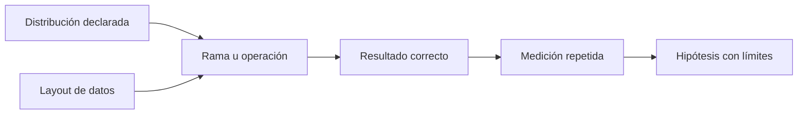

# Ramas y layout orientado a datos

**Estado:** draft

Una condición y una representación de datos son decisiones de semántica antes
de ser oportunidades de rendimiento. La pregunta útil es qué operación se
repite, sobre qué distribución y qué campos necesita realmente.

## Distribución antes de conclusión



Una entrada sesgada, alternada o pseudoaleatoria puede ejercitar una condición
de formas distintas. Medir solo una no demuestra un comportamiento general. De
forma similar, AoS y SoA no son etiquetas de rapidez: depende de si la
operación necesita todos los campos o solo los calientes.

## Modelos equivalentes

```rust
use rust_performance::layout::{count_positive, sum_hot_fields_aos, sum_hot_fields_soa, Record};

assert_eq!(count_positive(&[-3, 0, 2, 7]), 2);

let records = [Record::new(2, 10, "uno"), Record::new(3, 20, "dos")];
assert_eq!(sum_hot_fields_aos(&records), sum_hot_fields_soa(&[2, 3]));
```

El resultado compartido permite comparar una operación; no establece cuál
layout debe usar todo el sistema. En una operación que lee `cold` y `label`,
separar el campo caliente puede no ayudar.

## Cómo investigar

1. Define la condición y el resultado observable.
2. Genera distribuciones reproducibles que representen la carga.
3. Mantén los mismos elementos y operación entre representaciones.
4. Mide con el contrato del curso y registra dispersión, entrada y entorno.
5. Revisa complejidad, memoria y claridad antes de adoptar una variante.

## Ejercicios

1. Escribe tres distribuciones para `count_positive` y explica cuál representa
   datos de sensores con valores mayormente válidos.
2. Identifica qué campos debe leer una pantalla que muestra solo un contador y
   qué layout puede ser razonable investigar.
3. Diseña una prueba de corrección para migrar una colección AoS a SoA.
4. Explica por qué una mejora local puede no justificar duplicar estructuras.

## Soluciones orientativas

1. Usa sesgada positiva, alternada y pseudoaleatoria con semilla; la elección
   depende de la distribución observada, no de una preferencia de benchmark.
2. Si solo consume el contador, un array de ese campo es una hipótesis; mide
   sin inventar que otras rutas no requieren el registro completo.
3. Comprueba longitud, correspondencia por posición y todos los resultados
   observables antes de comparar tiempos.
4. La duplicación añade sincronización, memoria y superficie de errores; la
   decisión debe considerar el sistema completo.

## Límites

No se mide aquí mispredicción, vectorización automática ni fallos de caché. Un
perfil o contador de hardware puede profundizar la investigación, pero no
sustituye declarar la carga ni conservar corrección.
