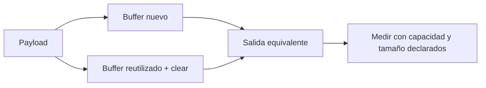

# Asignaciones y costo de propiedad

**Estado:** draft

Una asignación es un costo posible, no una anomalía automática. La decisión de
reutilizar memoria necesita una carga concreta, una vida útil clara y una
prueba de que el resultado sigue siendo correcto.

## Línea base y reutilización



`build_message_fresh` establece una línea base sencilla. `build_message_reused`
limpia el buffer antes de reconstruir la salida y devuelve solo la vista actual.
Esto evita que bytes de una operación anterior se filtren al resultado nuevo.

```rust
use rust_performance::allocation::{build_message_fresh, build_message_reused};

let mut buffer = Vec::with_capacity(32);
assert_eq!(build_message_fresh("hola"), build_message_reused(&mut buffer, "hola"));
```

## Qué comparar

Mantén el mismo payload y los mismos bytes de salida. Separa generación de
entrada, construcción y consumo de la salida. Declara capacidad inicial,
longitudes habituales y máximas, porque un buffer que nunca crece en el ejemplo
puede crecer en producción.

## Ownership como parte del costo

Reutilizar un buffer puede requerir que el llamador conserve ownership más
tiempo. Esa decisión puede evitar asignaciones y también acoplar capas o retener
memoria innecesaria. La alternativa clara puede ser preferible si la ruta no es
caliente o si la reutilización complica la corrección.

## Ejercicios

1. Explica por qué `clear` es necesario antes de escribir una salida más corta.
2. Diseña una carga con payloads cortos y largos para investigar capacidad.
3. Indica qué propiedad de ownership cambia si un buffer se presta a un helper.
4. Describe una situación donde es mejor asignar un buffer nuevo.

## Soluciones orientativas

1. Sin `clear`, los bytes anteriores continúan dentro del vector y la longitud
   puede incluir contenido que no pertenece al mensaje actual.
2. Conserva distribución, orden y repetición de tamaños; no midas solo el caso
   que favorece la capacidad elegida.
3. El préstamo mutable impide usos concurrentes del mismo buffer hasta que la
   operación termina; eso protege corrección y condiciona el diseño.
4. Si la vida del resultado excede la del llamador, o si retener capacidad
   grande es costoso, un buffer nuevo puede ser más claro y adecuado.

## Límites

Este capítulo no cuenta asignaciones del allocator ni concluye una mejora sin
benchmark. Capacidad, plataforma, tipo de allocator y distribución de tamaños
son parte del contexto de cualquier medición.
