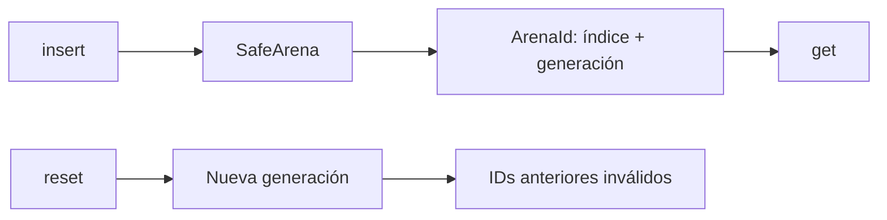

# Arenas seguras y ciclos de vida

**Estado:** draft

Una arena no es solo una forma de obtener memoria: expresa que varios valores
comparten un ciclo de vida. Si ese ciclo no es real o no se puede explicar, una
arena puede ocultar más complejidad que la que elimina.

## Modelo seguro



`SafeArena<T>` conserva valores en un `Vec<T>` y devuelve un identificador con
índice y generación. `reset` vacía la colección e incrementa la generación:
un ID anterior deja de ser válido sin necesitar punteros crudos ni `unsafe`.

```rust
use rust_performance::arena::SafeArena;

let mut arena = SafeArena::with_capacity(2);
let old = arena.insert("temporal");
assert_eq!(arena.get(old), Some(&"temporal"));

arena.reset();
assert_eq!(arena.get(old), None);
```

## Cuándo investigar una arena

Una arena puede ser una hipótesis si una carga crea muchos valores que expiran
juntos. Antes de adoptarla, define el límite del ciclo de vida, mide la línea
base y verifica que los consumidores pueden manejar IDs inválidos después del
reset.

## Alternativas

| Alternativa | Cuándo es adecuada |
|---|---|
| `Vec<T>` común | Valores con vida independiente o acceso por posición simple. |
| `SafeArena<T>` | Lote con reset explícito y handles verificables. |
| Arena de referencias estable | Solo con un contrato de seguridad y necesidad real; fuera de este curso. |

## Ejercicios

1. Explica por qué un ID anterior a `reset` no puede recuperar un valor nuevo.
2. Diseña un lote de parsing que justifique una vida compartida.
3. Compara el costo de manejar `Option<&T>` contra asumir un ID válido.
4. Describe cuándo conservar capacidad tras `reset` puede ser perjudicial.

## Soluciones orientativas

1. La generación cambió: el mismo índice podría referir un valor distinto y
   devolverlo sería una violación de la semántica del handle.
2. Un conjunto de nodos temporales para un documento puede expirar al terminar
   la solicitud; la decisión depende de que ningún consumidor lo necesite
   después.
3. La comprobación evita usar valores invalidados; su costo debe evaluarse en
   la carga real, no asumirse despreciable.
4. Un pico excepcional puede dejar memoria retenida; considera un límite o una
   estrategia de liberación cuando el perfil lo justifique.

## Límites

Este modelo no ofrece direcciones estables, desasignación individual ni conteo
de asignaciones. Enseña la relación entre handles, reset y ciclo de vida sin
usar `unsafe`.
