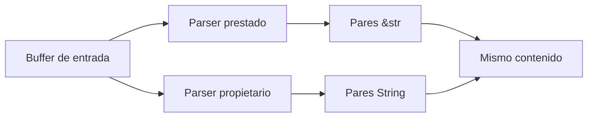

# Zero-copy, buffers y serialización

**Estado:** draft

Evitar una copia puede ahorrar trabajo y también extender una dependencia de
vida útil. Zero-copy es una decisión de interfaz y ownership antes de ser una
optimización.

## Dos representaciones, un formato



`parse_borrowed` devuelve slices que viven dentro de la entrada. `parse_owned`
reconoce el mismo formato y crea `String` independientes. La primera variante
no copia cada campo; la segunda puede cruzar una frontera donde el buffer no
vivirá lo suficiente.

```rust
use rust_performance::zero_copy::{parse_borrowed, parse_owned};

assert_eq!(parse_borrowed("lang=rust;mode=release")?, [("lang", "rust"), ("mode", "release")]);
assert_eq!(parse_owned("lang=rust;mode=release")?.len(), 2);
# Ok::<(), rust_performance::zero_copy::ParseError>(())
```

## Cuándo elegir cada variante

Usa préstamos cuando el consumidor termina antes que el buffer y la interfaz
puede expresar ese lifetime con claridad. Copia cuando el resultado debe viajar
a otra tarea, persistir más tiempo o simplificar ownership en una frontera.
Mide con tamaños, codificación y distribución reales: el costo de copiar puede
no dominar la carga total.

## Ejercicios

1. Explica por qué no puedes devolver pares prestados de una función que creó
   localmente su buffer de red.
2. Añade una prueba para un segmento vacío y decide su semántica.
3. Diseña una carga que compare mensajes cortos y mensajes largos.
4. Identifica una frontera donde copiar mejora claridad aunque cueste memoria.

## Soluciones orientativas

1. El buffer local se destruye al regresar; las referencias quedarían colgando,
   algo que Rust impide estáticamente.
2. La implementación ignora segmentos vacíos; documenta esa decisión y
   comprueba que no oculta un formato inválido en tu protocolo.
3. Conserva cantidad de pares, tamaños, codificación y semilla; separa generar
   datos de parsearlos.
4. Enviar datos a otra tarea o almacenarlos más allá de la respuesta suele
   requerir propiedad independiente.

## Límites

El parser no es un formato de serialización completo ni mide asignaciones.
Zero-copy puede trasladar complejidad a lifetimes y buffers; no se adopta sin
una hipótesis y evidencia de la carga real.
