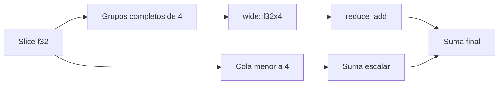

# SIMD y límites de vectorización

**Estado:** draft

SIMD aplica la misma operación a varios valores independientes en una sola
instrucción o grupo de lanes. No reemplaza una hipótesis: primero hay que
conservar la corrección de la operación y después medir si el compilador, el
hardware y el tamaño de entrada convierten esa representación en una mejora.

## Referencia, lanes y cola



`sum_f32_scalar` es la línea base de corrección. `sum_f32_wide` agrupa cuatro
valores, suma sus lanes con `wide::f32x4` y procesa de forma escalar los
elementos que no completan un grupo. La cola no es un detalle opcional: omitirla
cambiaría el resultado para longitudes que no fueran múltiplos de cuatro.

```rust
use rust_performance::simd::{sum_f32_scalar, sum_f32_wide};

let values = [1.0_f32, 2.0, 3.0, 4.0, 5.0];
let scalar = sum_f32_scalar(&values);
let wide = sum_f32_wide(&values);

assert!((scalar - wide).abs() < 1e-6);
```

## Cómo investigar la hipótesis

1. Declara la operación, la tolerancia numérica, el tamaño y la distribución de
   la entrada.
2. Conserva la variante escalar como oráculo de corrección.
3. Calienta ambas variantes y mide muchas iteraciones sin incluir la generación
   de datos.
4. Reporta mediana, dispersión, CPU, compilador y flags de compilación.
5. Repite en las arquitecturas que vayan a recibir el binario antes de afirmar
   que una variante es mejor.

El ejemplo `09_simd` ejecuta ambos recorridos sobre una entrada determinista.
Es una comprobación funcional, no un benchmark. Para una medición honesta usa
un tamaño fijo que represente la carga, ejecuta `cargo run --release --example
09_simd` varias veces y conserva el entorno junto con los resultados. No se
incluye un benchmark de tiempos como verdad universal porque el resultado
depende de ISA, optimizador, carga del sistema y precisión aceptada.

## Alternativas

| Alternativa | Uso adecuado | Límite |
|---|---|---|
| Bucle escalar | Línea base, entradas pequeñas o dependencia entre elementos. | Puede no aprovechar paralelismo de datos. |
| Auto-vectorización | El compilador reconoce una operación simple y el perfil lo justifica. | Hay que inspeccionar y medir; no es una garantía de API. |
| `wide` seguro | Mostrar lanes explícitos en Rust estable y validar contra referencia. | No abstrae diferencias de arquitectura ni garantiza velocidad. |
| Intrínsecos por CPU | Caso especializado con contrato de seguridad revisado. | Requiere `unsafe`; queda fuera del curso. |

## Ejercicios

1. Explica por qué una entrada de cinco valores necesita una cola escalar con
   lanes de cuatro elementos.
2. Añade una prueba para un slice vacío y comprueba su equivalencia con la
   referencia.
3. Diseña una medición con 16, 4 096 y 1 048 576 valores; registra qué dato
   adicional necesitas para interpretar una diferencia.
4. Describe una operación que no pueda agruparse sin cambiar su semántica y
   explica por qué SIMD no debe aplicarse por intuición.

## Soluciones orientativas

1. El primer grupo consume cuatro valores; el quinto debe sumarse también para
   preservar la operación original.
2. Ambas variantes devuelven cero; la prueba protege el contrato de identidad
   de la suma.
3. Registra CPU, arquitectura, versión de Rust, modo `--release`, repeticiones,
   calentamiento y dispersión, además de verificar el resultado numérico.
4. Una acumulación que depende del estado producido por el valor anterior no
   tiene independencia por lane; reordenarla puede cambiar el resultado o el
   error de redondeo.

## Límites

La suma de punto flotante no es asociativa de forma exacta: cambiar el orden de
reducción puede producir diferencias pequeñas. `wide` permite estudiar un
modelo SIMD seguro sobre Rust estable, pero no promete instrucciones idénticas
ni ganancias iguales en todas las arquitecturas. No se usa `unsafe`, nightly ni
intrínsecos específicos de plataforma en este curso.
